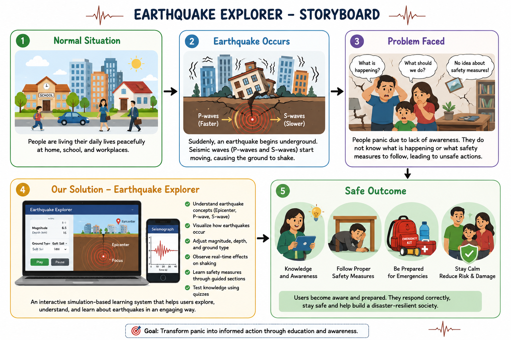
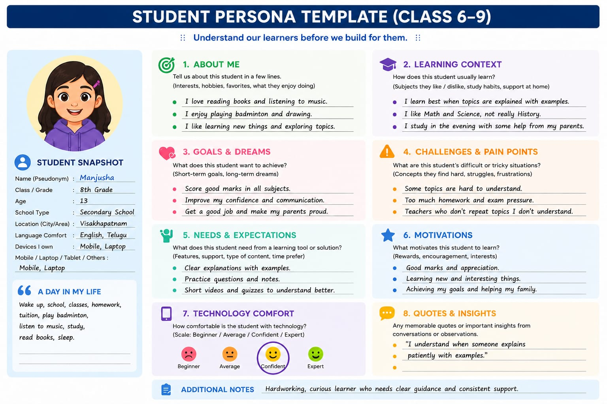

# 🌍 Earthquake Explorer – Interactive Simulation

## Project Title

Earthquake Explorer

##  Description

Earthquake Explorer is an interactive web-based simulation that helps users understand how earthquakes occur and how different factors like magnitude, depth, and ground type affect ground shaking.
---

## Problem Statement

Many people lack awareness about how earthquakes work and what safety measures to follow during such disasters. This lack of knowledge can lead to panic and unsafe actions.
---

## 💡 Solution

This project provides an interactive simulation that:

Visualizes earthquake behavior
Explains key concepts like epicenter and seismic waves
Educates users about safety measures
Helps users learn through real-time interaction and quizzes

---

##  Features

Interactive earthquake simulation (magnitude, depth, soil type)

Visualization of P-waves and S-waves

Foundations section for learning concepts

Real-life scenario simulation

Seismograph visualization

Safety measures guidance

Knowledge check quiz with retry option

---

## Requirements

### **User Interface**

* Sliders for Magnitude & Depth
* Ground type dropdown
* Dynamic shaking display

### **Simulation**

* Epicenter & Focus visualization
* P-wave & S-wave representation
* Adjustable parameters with real-time updates

### **Features**

* Foundations (concepts)
* Quake Lab (simulation)
* Scenarios, Seismograph
* Safety measures & Quiz

### **User Interaction**

* Scenario selection
* Play/Pause controls
* Quiz retry option

### **Learning Content**

* Earthquake concepts
* Wave behavior
* Safety instructions

### **Technical**

* Web-based application
* Responsive design
* Smooth animations

---

##  Storyboard



---

## 👤 User Persona



---

##  Team Details

### Team Members and Task Division

### 1. Sahithi (Team Lead)

* Designed complete project structure and flow
* Implemented earthquake simulation logic (magnitude, depth, soil effects)
* Designed UI/UX and interactive components


### 2. Manjusha (Design Support)

* Assisted in preparing project documentation
* Helped in creating storyboard and presentation materials
*Handled debugging, testing, and optimization

### 3. Durga (Research & Content Support)

* Collected information on earthquake concepts (P-wave, S-wave, epicenter)
* Assisted in preparing safety measures and quiz questions
* Contributed to requirement gathering and idea validation


---

##  Technologies Used

* HTML
* CSS
* JavaScript
* React (Vite)

---

##  Project Structure

```
src/
  App.jsx
  main.jsx
  styles/
    App.css
    index.css
  assets/
```

---

##  How to Run

1. Install dependencies:

```
npm install
```

2. Run project:

```
npm run dev
```

---

##  Learning Outcome

* Understand earthquake behavior
* Learn safety measures
* Improve awareness

---


## Deployed Link 

https://earthquake-theta.vercel.app/

---

## Conclusion

This project helps users understand earthquake concepts in an interactive way and improves awareness about safety measures, making learning both engaging and practical.